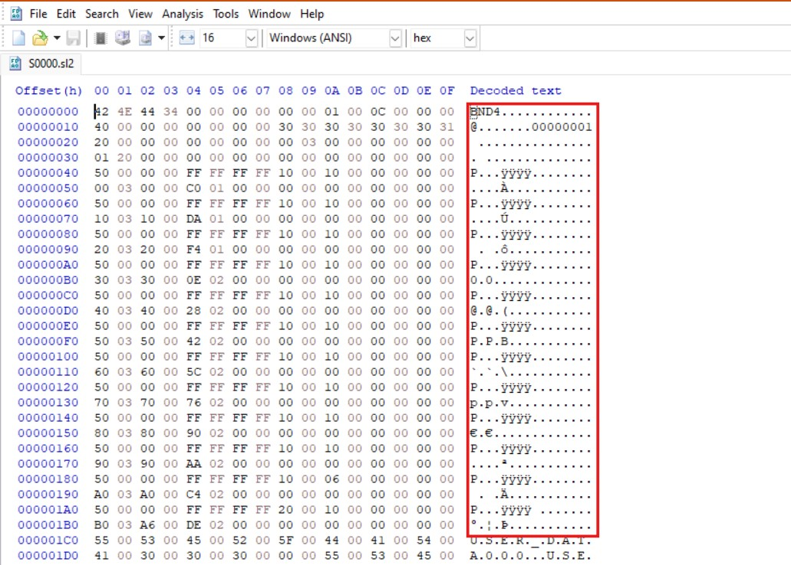
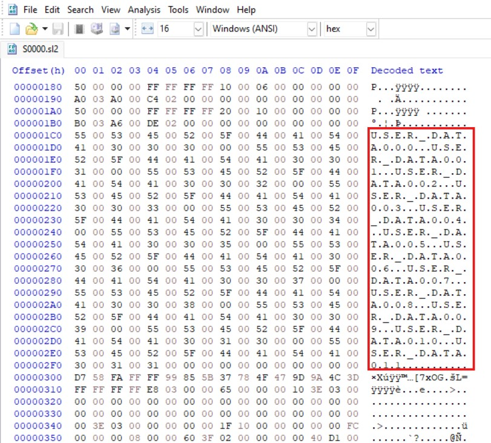
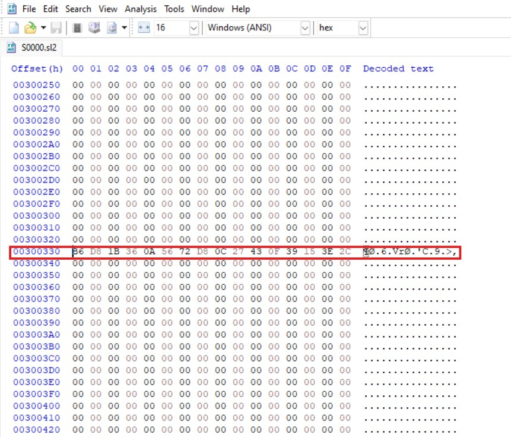
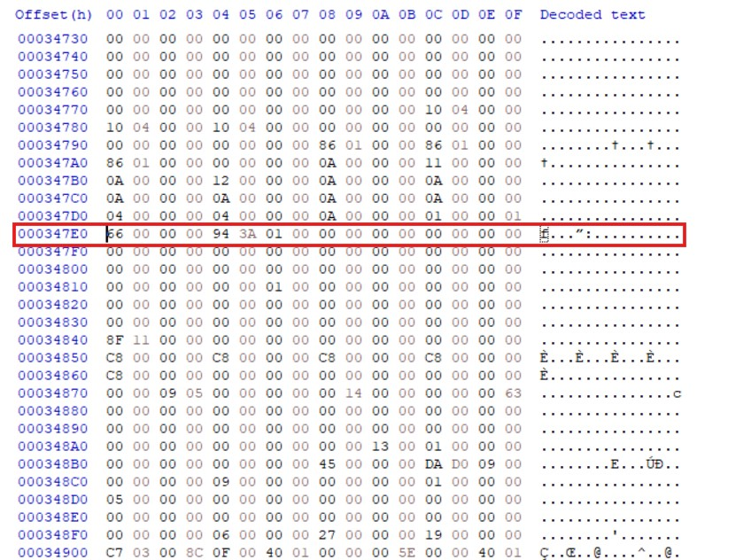
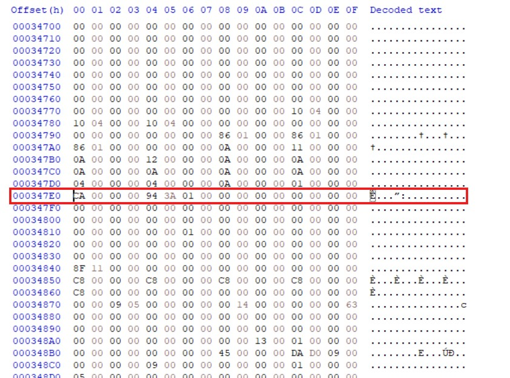
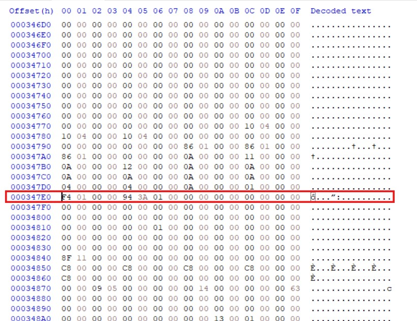
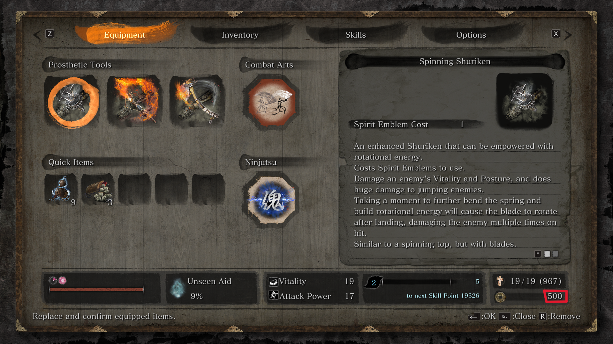

# Project 1 

## Aim 
Analysing a save file format of any game.

## Game 
For this project I have chosen a game I had just finished and was in the middle of my NG+. My game is Sekiro: Shadows Die Twice

Sekiro: Shadows Die Twice is a 2019 action-adventure Soulslike game played from third person view developed by FromSoftware, th company popularly known for releasing games like Dark Souls, Bloodbourne, Elden Ring etc. Players control Wolf, a shinobi who embarks on a quest to rescue his lord, and becomes embroiled into a conflict for Ashina's fate. The gameplay is focused on stealth, exploration, and combat, with a particular emphasis on boss battles. It takes place in a fictionalized Japan during the Sengoku period and makes strong references to Buddhist mythology and philosophy. Sekiro received acclaim from critics and it won several year-end awards, including the Game Award for Game of the Year, and has sold over ten million units as of September 2023. 

I consider it an achievement for myself to play and master a game like this. And now after this project I am even more delighted as I am able to analyse and understand something about its save file structure and lastly implement the changes I wanted to.

## Overview
The player character in this game carries only one weapon and a few weapon-like tools (he has got an amazing prosthetic arm to attach them to!) along with money and few boosters.

So basically I have tried to understand and locate where the amount of money (which is Sen in the game) is saved in the save of the game and edited it to increase my Sen in the game. For the whole project I have used just one tool Hxd to open my save file and edit it accordingly to get the desired results.

This process can be done for any of the boosters (or sugars what they call it which increases the attack, vitality, posture, stealth etc. temporarily) to increase their amount.

## Save File Analysis

### Location
Save file of Sekiro is saved with a .sl2 format along with a backup file stored as .sl2.bak. The save file can be generally found at the location : C/Users/(Username)/AppData/Roaming/Sekiro/(numbers). Here you can find two files, the main save game file S0000.sl2 and the backup file S0000.sl2.bak.

### Structure
Sekiro creates a save file on the path mentioned above as S0000.sl2 and a backup save file as S0000.sl2.bak both of which are of the size 11649 Kilobytes. On looking the S0000.sl2 file in HxD we can see that the file starts from 0x000000 to 0xB603CF. The data from 000 to 1BF is not understandable but after much altering the game data we can see that this part in not changing at all. This chunk of data seems to be storing the data related to save file like basic headers, file type (which is BND4) and all. 

After this from the offset 1C0 to 2F0 appears to be storing some readable strings which is USER DATA000 to USER DATA011. This seems to explain the further structure of the file. The file seems to store the game progress of 12 different users in these 12 different user data and thus providing option to player of 12 data slots.

On examining the file further we can see that there seems to be almost no data from 200320 to A003A0 except that one same string after every offset of 0x100010. After a careful analysis it was clear that this was nothing but the `MD5 hash` checksum of empty data of size 100010. 

After A003A0 we can see some weird data but after looking carefully we can see it stores the control settings of the different user data. It also stores many except this but I was not much interested in this data.
So after all the above analysis we can conclude that there are only 10 game save slots (which is actually what game says) from 000300 to A003A0 each of the size 0x100010 bytes or 1025 Kilobytes. After this I started examining my own game slot and found that most of it contains no data except a few chunks of which some are not even present after changing some data in game. Mainly the data chunks were present at the offsets `300, 640, 2A650, 34140, 34900, 360A0, 8F930, 96A10, 98A20, A1AB0, A5A60, D4D70, F4B20, F6A80`.

## Procedure
What I just did is try to change the value of Sen by looking for it in the file and change the value and make it working properly. I had 102 Sen which in hexadecimal is 0x66. I changed my Sen in game from 102 to 202 and then saved my game. After this I tried to vimdiff the two save files. This gave me not much good results as there were many differences. So I opened the HxD and tried to search the hex value `0x66` in the previous save file and the new save file.

I cancelled out all the locations which were common in both the files and was left with only one offset `347E0`. This offset had the value 0xCA in the new file which is indeed 202 in decimal form. So I finally found the location where the Sen value was stored in the save file. I edited it to FF and did the checksum of this game slot and finally here I got 255 Sen. Then I changed the value to 500 Sen that is `01 F4` in hex but this gave me `62465`. After looking the hex of 62465 I saw it was F401. So I understood how it was working and changed the value to `F4 01` and finally got `500` Sen. 

## Result
In the game Sekiro, the Sen value is stored as 4 bytes data from the offset 0x0347E0 to 0x0347E4 in the save file S0000.sl2 of the game.