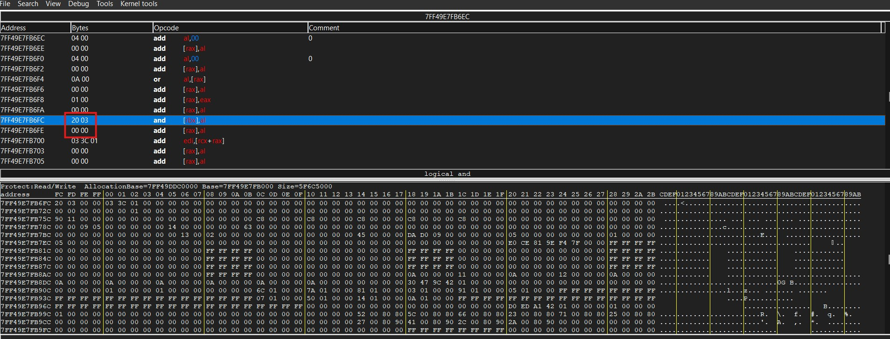

# Project 2

## Aim
Hacking a game/application using reverse engineering or memory corruption.

## Game/application
For this project also I have again chosen the same game as in my previous project, that is, Sekiro: Shadows Die Twice. As I have already introduced this game in previous project, Sekiro: Shadows Die Twice is a 2019 action-adventure Soulslike game played from third person view developed by FromSoftware, th company popularly known for releasing games like Dark Souls, Bloodbourne, Elden Ring etc. Players control Wolf, a shinobi who embarks on a quest to rescue his lord, and becomes embroiled into a conflict for Ashina's fate. The gameplay is focused on stealth, exploration, and combat, with a particular emphasis on boss battles. It takes place in a fictionalized Japan during the Sengoku period and makes strong references to Buddhist mythology and philosophy. Sekiro received acclaim from critics and it won several year-end awards, including the Game Award for Game of the Year, and has sold over ten million units as of September 2023.

It is a great achievement for me and I am very glad that I was able to reverse and understand some part of the code of such a complex game and was able to overwrite memory to get my desired result.

## Overview
Just like the previous project, what I tried to do was same. I just wanted to increase my Sen in the game.

I was able to do this by understanding the source code of the game and overwriting the memory that stores this data. For this project, I have used just the tools Cheat Engine and Ghidra to disassemble the game and reach out and also edit code at the memory address I required.

A similar process can be again repeated for the sugars to change their amount.

## Procedure
I opened the game in Ghidra decompiler to decompile the game and get its source code. I was easily able to do so and I could see an entry function which was calling __scrt__main function and some debug sort of function. I could not understand it much as it included too many functions and data and I was overwhelmed with it. 

Then I found out that there is a game hacking specific disassembler and debugger called Cheat Engine. So I opened the game in it and tried to locate where the Sen value is stored in the code. Using the normal scan tools I easily found out at what address and memory the Sen value was being stored which was 7ff49e7fb6fc. 

I browsed and disassembled the memory region around this code and tried to understood what was happening. I understood that the assembly instruction opcodes were being used to store the amount of Sen. 

So I manually tried to change the instructions to get my desired bytes in the opcode. And there it goes, I was able to change the value of Sen in the game runtime by just changing the assembly instructions in the code.

