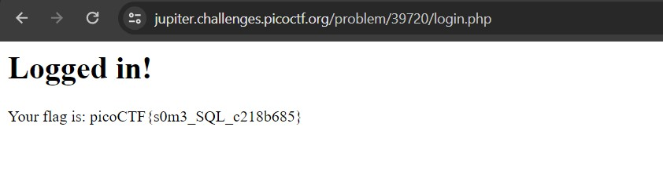
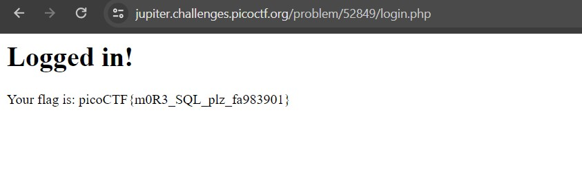
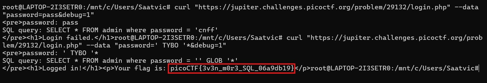

# Irish Name Repo 1

## Description 
There is a website running at https://jupiter.challenges.picoctf.org/problem/39720/ or http://jupiter.challenges.picoctf.org:39720. Do you think you can log us in? Try to see if you can login!

## Challenge links 
https://jupiter.challenges.picoctf.org/problem/39720/

## Solution 
We are given a website. We can go to menu and select the admin login page. It seems to be working on SQL query. We can just enter username as `admin' --` and any password of our choice because --  will comment out the password part of query. This will give us the flag. 

## Flag 
picoCTF{s0m3_SQL_c218b685}

# Irish Name Repo 2

## Description 
There is a website running at https://jupiter.challenges.picoctf.org/problem/52849/. Someone has bypassed the login before, and now it's being strengthened. Try to see if you can still login!

## Challenge links 
https://jupiter.challenges.picoctf.org/problem/52849/

## Solution 
We are given a link for similar website. We can again just enter username and password as above to comment out our query to get our flag.

## Flag 
picoCTF{m0R3_SQL_plz_fa983901}

# Irish Name Repo 3

## Description 
There is a secure website running at https://jupiter.challenges.picoctf.org/problem/29132/ or http://jupiter.challenges.picoctf.org:29132. Try to see if you can login as admin!

## Challenge links 
https://jupiter.challenges.picoctf.org/problem/29132/

## Solution 
We are again given the same website but this time we are just being asked password. On looking for source HTML file we can see a new hidden variable debug whose value is 0. On changing the value of this variable to 1 we can see the SQL query that is checking the password. After entering any random password we can see that in query it is encrypting it with a cipher which is rotation 13 Caeser cipher. We can enter password as `' TYBO '*` which on rotation 13 gives as `' GLOB '*`. This gives us the flag.

## Flag 
picoCTF{3v3n_m0r3_SQL_06a9db19}