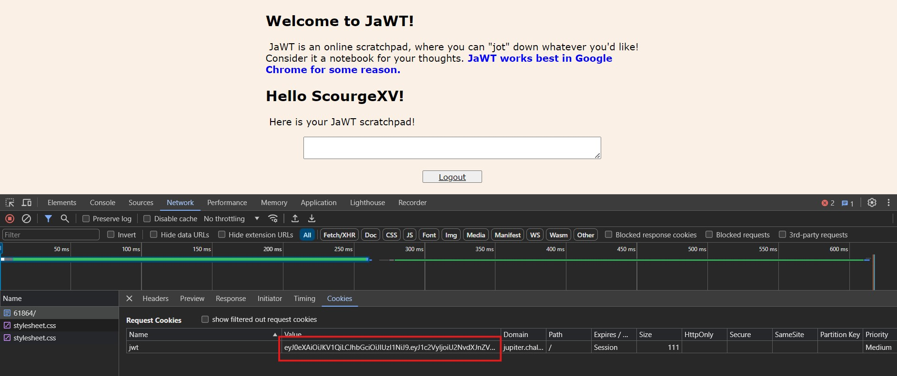
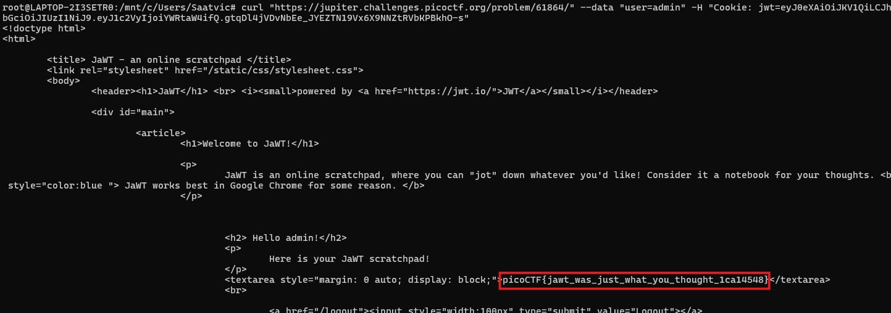

# JaWT Scratchpad

## Description 
Check the admin scratchpad!

## Challenge link 
https://jupiter.challenges.picoctf.org/problem/61864/

## Solution 
We are given a website which takes username and opens a scratchpad. This website also a link to jwt.io and john the ripper git repo. When we enter any username instead of admin we can see a cookie that stores the jwt of the username entered.

Using john the ripper we can crack the signature of token to be `ilovepico`. Changing the value user to admin and signing the jwt with this key we get a new token. When we enter the user to be admin and enter this new jwt in the cookie header we get the flag.

## Flag 
picoCTF{jawt_was_just_what_you_thought_1ca14548}