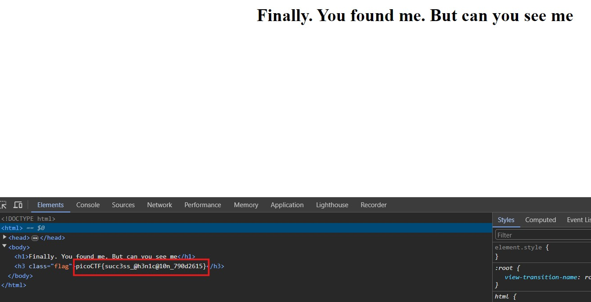

# Secrets

## Description 
We have several pages hidden. Can you find the one with the flag? The website is running here.

## Challenge link 
http://saturn.picoctf.net:62147/

## Solution 
When we inspect the given website we can see that all the css code and images are saved under secret/assets/. We can edit URL to http://saturn.picoctf.net:62147/secret/. On inspecting this wepage we can see another page as hidden so we can edit the URL to http://saturn.picoctf.net:62147/secret/hidden/. Again inspecting this page we can see another directory superhidden. So we can edit the URL to be http://saturn.picoctf.net:62147/secret/hidden/superhidden/ and on inspecting this page we can see the flag in source.

## Flag 
picoCTF{succ3ss_@h3n1c@10n_790d2615}