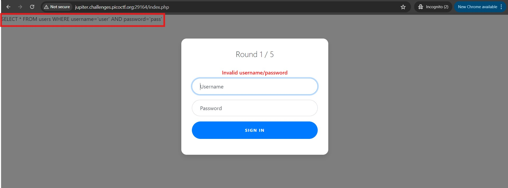
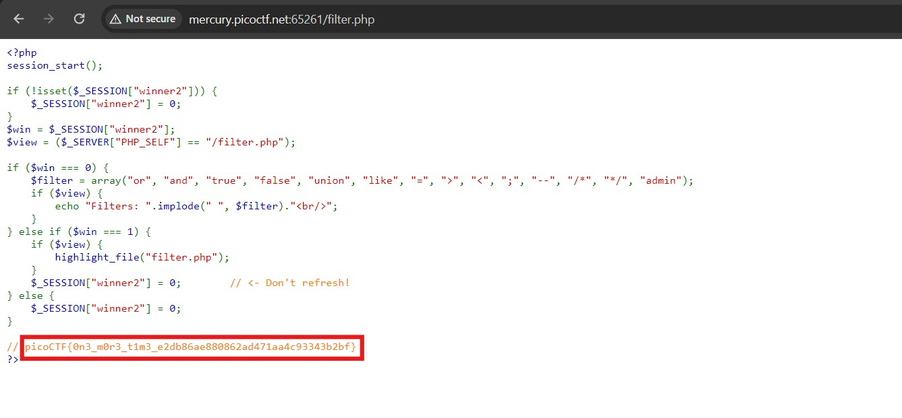
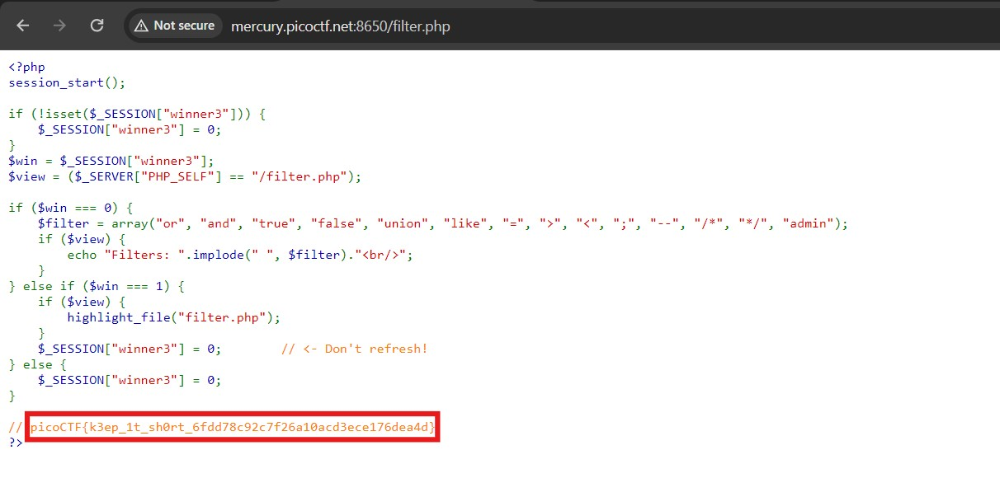

# Web Gauntlet 1

## Description  
Can you beat the filters? Log in as admin.

## Challenge links 
http://jupiter.challenges.picoctf.org:29164/ 
http://jupiter.challenges.picoctf.org:29164/filter.php

## Solution 
We are given two links. First one contains a login page where we are supposed to login as admin. The second link has filters for the given login page. When we enter any random username and password we can see a SQL query in the background image. 

So we just need to change the query using our inputs. In first round we can just comment out the remaining query using '--' in username. In second round we can comment by using '/*'. We can do this again for third round. For the fourth round we cannot use admin word. So we us 'ad' and concatinate it with 'min' using '||'. This can be done again for fifth round and we finally see the php code for the filters in second link. In this code we can see the flag commented in the last.

## Flag 
picoCTF{y0u_m4d3_1t_a3ed4355668e74af0ecbb7496c8dd7c5}

# Web Gauntlet 2

## Description 
This website looks familiar... Log in as admin Site:

## Challenge links 
http://mercury.picoctf.net:65261/ 
http://mercury.picoctf.net:65261/filter.php

## Solution 
We are given two links. First one contains a login page where we are supposed to login as admin. The second link has filters for the given login page. We can again see a SQL query in the background. after looking for SQL operators similar to 'LIKE' we get 'GLOB' which accepts wildcards. So we can enter username as `ad'||'min` an the password as `' GLOB '*`. This query works fine and we get the php code for filters in second link which contains the flag commented in the last.

## Flag 
picoCTF{0n3_m0r3_t1m3_e2db86ae880862ad471aa4c93343b2bf}

# Web Gauntlet 3

## Description 
Last time, I promise! Only 25 characters this time. Log in as admin.

## Challenge links 
http://mercury.picoctf.net:8650/ 
http://mercury.picoctf.net:8650/filter.php

## Solution 
We are again two links just like previous challenges. We can again use GLOB operator for this challenge also and we will get the flag.

## Flag 
picoCTF{k3ep_1t_sh0rt_6fdd78c92c7f26a10acd3ece176dea4d}
