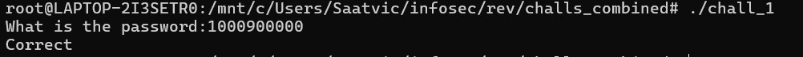

# Chall 1 

## Challenge file 
chall_1

## Solution 
We are given a file which seems to be an ELF executable file. After decompiling the file using Hex-Rays in Dogbolt we get the following code
``` c
#include <defs.h>


//-------------------------------------------------------------------------
// Function declarations

__int64 (**init_proc())(void);
void sub_1020();
void sub_1030();
void sub_1040();
void sub_1050();
void sub_1060();
void sub_1070();
void sub_1080();
// int __fastcall _cxa_finalize(void *);
// int puts(const char *s);
// size_t strlen(const char *s);
// int printf(const char *format, ...);
// size_t strcspn(const char *s, const char *reject);
// char *fgets(char *s, int n, FILE *stream);
void __fastcall __noreturn start(__int64 a1, __int64 a2, void (*a3)(void));
FILE **deregister_tm_clones();
__int64 register_tm_clones();
FILE **_do_global_dtors_aux();
__int64 frame_dummy(); // weak
int __fastcall main(int argc, const char **argv, const char **envp);
_BOOL8 __fastcall check(__int64 a1);
void term_proc();
// int __fastcall _libc_start_main(int (__fastcall *main)(int, char **, char **), int argc, char **ubp_av, void (*init)(void), void (*fini)(void), void (*rtld_fini)(void), void *stack_end);
// int __fastcall __cxa_finalize(void *);
// __int64 _gmon_start__(void); weak

//-------------------------------------------------------------------------
// Data declarations

void *_dso_handle = &_dso_handle; // idb
FILE *_bss_start; // idb
char completed_0; // weak


//----- (0000000000001000) ----------------------------------------------------
__int64 (**init_proc())(void)
{
  __int64 (**result)(void); // rax

  result = &_gmon_start__;
  if ( &_gmon_start__ )
    return (__int64 (**)(void))_gmon_start__();
  return result;
}
// 4070: using guessed type __int64 _gmon_start__(void);

//----- (0000000000001020) ----------------------------------------------------
void sub_1020()
{
  JUMPOUT(0LL);
}
// 1026: control flows out of bounds to 0

//----- (0000000000001030) ----------------------------------------------------
void sub_1030()
{
  sub_1020();
}

//----- (0000000000001040) ----------------------------------------------------
void sub_1040()
{
  sub_1020();
}

//----- (0000000000001050) ----------------------------------------------------
void sub_1050()
{
  sub_1020();
}

//----- (0000000000001060) ----------------------------------------------------
void sub_1060()
{
  sub_1020();
}

//----- (0000000000001070) ----------------------------------------------------
void sub_1070()
{
  sub_1020();
}

//----- (0000000000001080) ----------------------------------------------------
void sub_1080()
{
  sub_1020();
}

//----- (0000000000001100) ----------------------------------------------------
// positive sp value has been detected, the output may be wrong!
void __fastcall __noreturn start(__int64 a1, __int64 a2, void (*a3)(void))
{
  __int64 v3; // rax
  int v4; // esi
  __int64 v5; // [rsp-8h] [rbp-8h] BYREF
  char *retaddr; // [rsp+0h] [rbp+0h] BYREF

  v4 = v5;
  v5 = v3;
  _libc_start_main((int (__fastcall *)(int, char **, char **))main, v4, &retaddr, 0LL, 0LL, a3, &v5);
  __halt();
}
// 110A: positive sp value 8 has been found
// 1111: variable 'v3' is possibly undefined

//----- (0000000000001130) ----------------------------------------------------
FILE **deregister_tm_clones()
{
  return &_bss_start;
}

//----- (0000000000001160) ----------------------------------------------------
__int64 register_tm_clones()
{
  return 0LL;
}

//----- (00000000000011A0) ----------------------------------------------------
FILE **_do_global_dtors_aux()
{
  FILE **result; // rax

  if ( !completed_0 )
  {
    if ( &__cxa_finalize )
      _cxa_finalize(_dso_handle);
    result = deregister_tm_clones();
    completed_0 = 1;
  }
  return result;
}
// 4018: using guessed type char completed_0;

//----- (00000000000011E0) ----------------------------------------------------
__int64 frame_dummy()
{
  return register_tm_clones();
}
// 11E0: using guessed type __int64 frame_dummy();

//----- (00000000000011E9) ----------------------------------------------------
int __fastcall main(int argc, const char **argv, const char **envp)
{
  char s[264]; // [rsp+0h] [rbp-110h] BYREF
  unsigned __int64 v5; // [rsp+108h] [rbp-8h]

  v5 = __readfsqword(0x28u);
  printf("What is the password:");
  fgets(s, 256, _bss_start);
  s[strcspn(s, "\n")] = 0;
  if ( check((__int64)s) )
    puts("Correct");
  else
    puts("Incorrect");
  return 0;
}
// 11E9: using guessed type char s[264];

//----- (00000000000012A6) ----------------------------------------------------
_BOOL8 __fastcall check(__int64 a1)
{
  return (unsigned int)strlen((const char *)a1) == 10 && *(_BYTE *)a1 == 49 && *(_BYTE *)(a1 + 4) == 57;
}

//----- (00000000000012F4) ----------------------------------------------------
void term_proc()
{
  ;
}
```
In tis code we can see a line which is checking whether the password entered is having length 10 and first and fifth element must be 1 and 9 respectively. If it follows then this is the password.
``` c
return (unsigned int)strlen((const char *)a1) == 10 && *(_BYTE *)a1 == 49 && *(_BYTE *)(a1 + 4) == 57;
```
From this we can conclude that the password is 1000900000


## Password 
1000900000