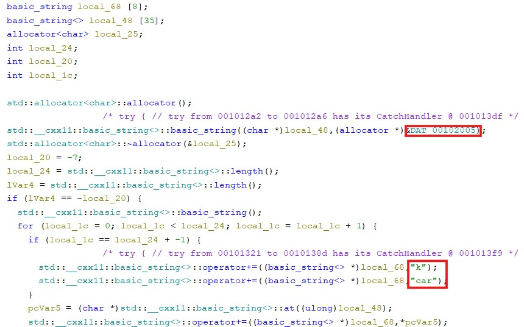

# Chall 2 

## Challenge link 
chall_2

## Solution 
We are given a file which is an ELF executable file. After analysing the file using Ghidra we get the code. This code includes a function named `checkPassword` which is accepting a parameter and creating a new variable using some predefined variables and strings and then checking it with the argument. If it matches the argument it allows to login. The first pre defined variable is local_48 which has a string `dec`. The program is iterated to add characters `d`, `e` for dec and then they are supposed to add `k` and `car` and in the end add the remaining `c` of dec.

This gives us `dekcarc` which on reversing gives us the password `cracked`.

## Password 
cracked