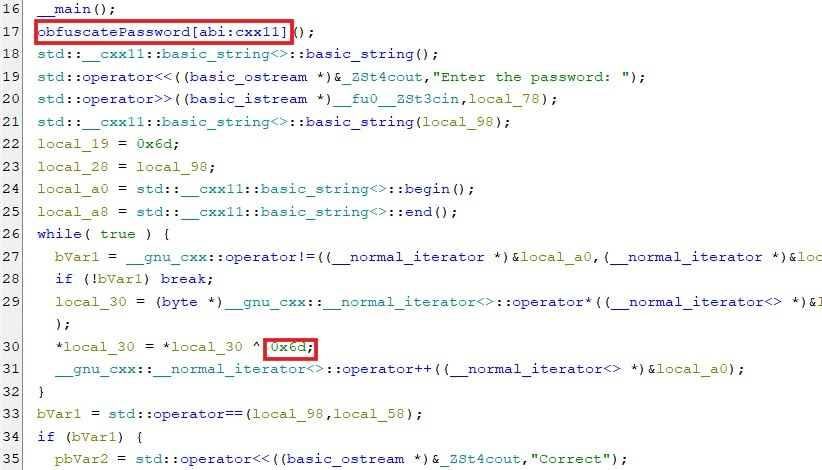
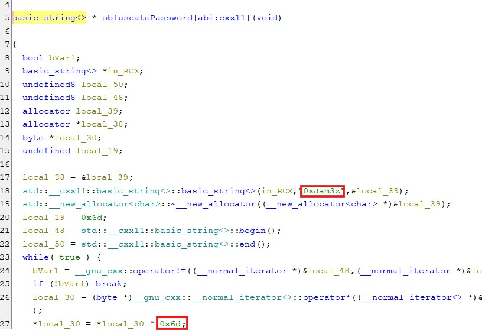
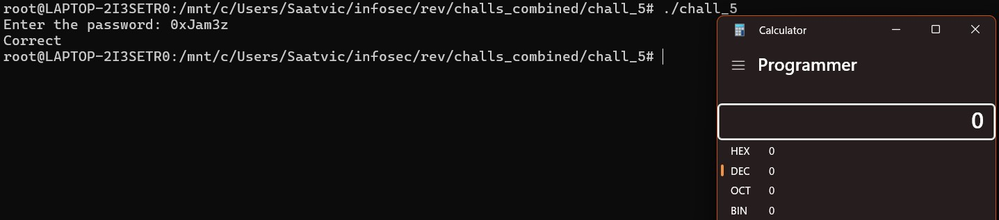

# Chall 5

## Challenge link
Chall_5

## Solution
We are give a PE32+ executable file. After analysing it using Ghidra we can see that in the main function a function named `obfuscatePassword` is called and the entered password is copied to another variable and xored with th hex number `0x6d`. Then the result of xor is checked with the value returned from the obfuscatePassword function. If they match the password is correct. 

In the obfuscatePassword function we can see that the predefined string `0xJam3z` is being xored with hex number 0x6d.
 
As we know XOR is symmetric, the password would be 0xJam3z. In the end it would call calculator.

## Password
0xJam3z